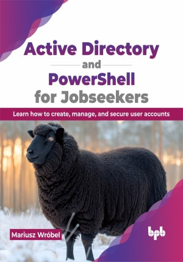

# Active Directory and PowerShell for Jobseekers

Start your career in Identity and Access Management field by learning about Active Directory and automate your work using PowerShell

This is the repository for [Active Directory and PowerShell for Jobseekers
](https://bpbonline.com/products/active-directory-and-powershell-for-jobseekers),published by BPB Publications.

## About the Book
“Active Directory and PowerShell for Jobseekers” takes you by the hand, and equips you with essential skills sought after by employers in today's IT landscape.

This book walks you through every step of the Active Directory lifecycle, covering design, deployment, configuration, and management. Automation using PowerShell is emphasized, helping you learn how to automate processes with scripts. It begins with Active Directory management, creating a development environment in Azure. In the next stage you get a thorough overview of environment creation, configuration, monitoring, security settings and recovery. With examples presented through both manual steps and automated PowerShell scripts, this book allows readers to choose their preferred method for learning PowerShell automation. Additionally, it also introduces DevOps tools for cloud infrastructure, covering update management, monitoring, security, and automation resources. 

By the end of this book, you'll be confident and prepared to tackle real-world Active Directory challenges. You will also be able to impress potential employers with your in-demand skills and launch your career as a sought-after IT security specialist. 

## What You Will Learn
• Learn about building the AD test environment in Azure.

• Configure Windows Servers to become AD domain controllers including DNS.

• Configure Active Directory to support network topology and customers’ needs.

• Secure and automate infrastructure management.

• Get familiar with interview questions that are related to the AD and PowerShell related jobs market.
